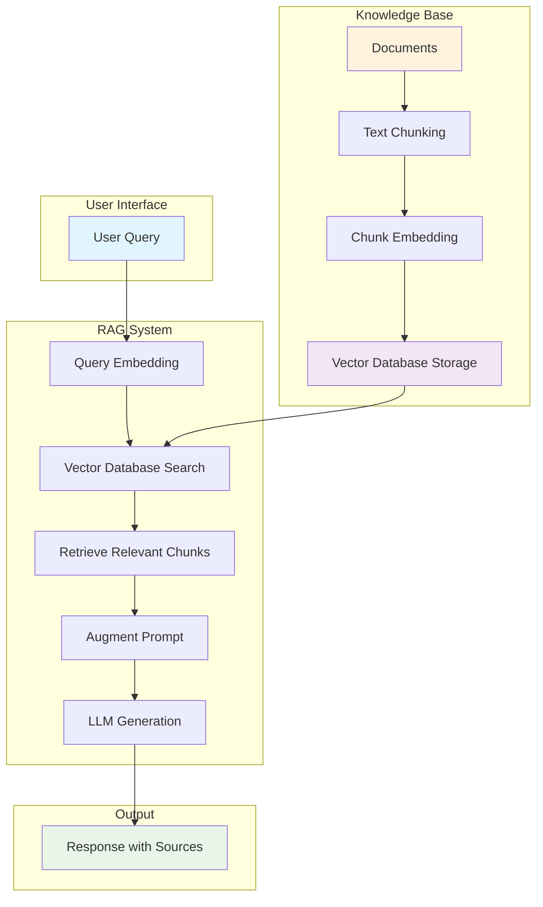
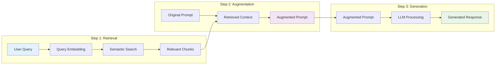
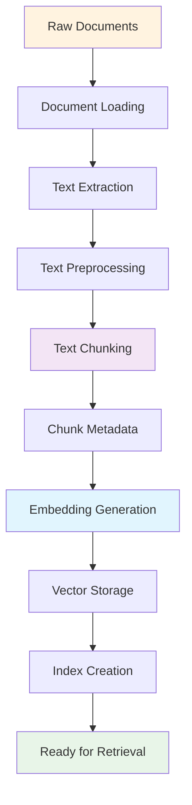
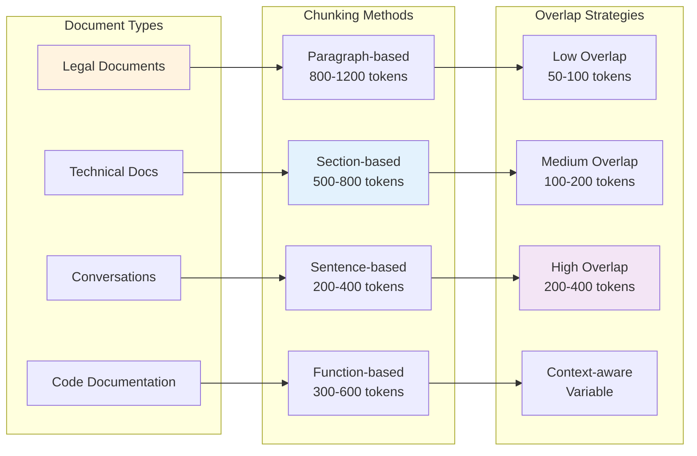

# RAG (Retrieval-Augmented Generation): A Comprehensive Guide

## Table of Contents
1. [Introduction](#introduction)
2. [The Problem RAG Solves](#the-problem-rag-solves)
3. [What is RAG?](#what-is-rag)
4. [How RAG Works: The Three-Step Process](#how-rag-works-the-three-step-process)
5. [Key Components and Technologies](#key-components-and-technologies)
6. [Implementation Strategies](#implementation-strategies)
7. [Practical Applications](#practical-applications)
8. [Best Practices and Considerations](#best-practices-and-considerations)
9. [Challenges and Limitations](#challenges-and-limitations)
10. [Future of RAG](#future-of-rag)

## Introduction

Retrieval-Augmented Generation (RAG) represents a revolutionary approach to enhancing Large Language Models (LLMs) by combining the power of information retrieval with text generation. This hybrid methodology addresses one of the most significant limitations of traditional LLMs: their reliance on static training data that can quickly become outdated.

RAG enables AI systems to access real-time, up-to-date information from external knowledge bases, making them more accurate, relevant, and useful for enterprise applications. Instead of being confined to pre-training knowledge, RAG-equipped systems can dynamically retrieve and incorporate fresh information to provide more accurate and contextually relevant responses.

## The Problem RAG Solves

### Traditional LLM Limitations

Consider a scenario where your company has 500 gigabytes of documents on their server, and you need to connect an AI assistant (like ChatGPT) to answer questions about these documents. Traditional chat applications face several critical limitations:

1. **Context Window Constraints**: Most chat applications can only accept a dozen files at most, making it impossible to process large document collections.

2. **Static Knowledge Base**: LLMs rely on pre-training data that becomes outdated quickly, limiting their ability to provide current information.

3. **Inefficient Search Methods**: Simple keyword-based search through entire document collections is computationally expensive and often yields irrelevant results.

4. **Lack of Domain-Specific Knowledge**: Pre-trained models may not have access to proprietary or specialized information specific to your organization.

### The RAG Solution

RAG addresses these challenges by creating a dynamic bridge between static LLM knowledge and real-time, relevant information retrieval. It allows AI systems to:

- Access vast amounts of up-to-date information
- Provide answers grounded in specific, relevant documents
- Maintain accuracy without requiring model retraining
- Scale to enterprise-level document collections

## What is RAG?

RAG (Retrieval-Augmented Generation) is a technique that enhances the capabilities of Large Language Models by combining two key processes:

1. **Retrieval**: Finding relevant information from external knowledge sources
2. **Augmented Generation**: Using that retrieved information to generate more accurate and contextually relevant responses

The core innovation of RAG lies in its use of **semantic search** through vector embeddings, which allows the system to understand the meaning and context of queries rather than just matching keywords.

### Key Innovation: Vector Embeddings

At the heart of RAG is the concept of **word embeddings** - converting human language into numerical representations that computers can process. This transformation enables:

- **Semantic Understanding**: The system can match queries based on meaning, not just exact word matches
- **Efficient Storage**: Documents are stored as vectors in a database, enabling fast retrieval
- **Context Preservation**: The semantic relationships between concepts are maintained

## How RAG Works: The Three-Step Process

RAG operates through three distinct but interconnected steps:

### RAG Architecture Overview



### The Three-Step Process Flow



### 1. Retrieval

The retrieval phase involves finding relevant information from the knowledge base:

**Process:**
- Convert the user's question into a vector embedding using the same embedding model used for documents
- Perform semantic search by comparing the question's embedding against document embeddings
- Retrieve the most semantically similar document chunks

**Example:**
For the question "Can you tell me about last year's service agreement with CodeCloud?"
- The question is converted to a vector embedding
- The system searches through all document embeddings to find the most relevant chunks
- Results are ranked by semantic similarity rather than keyword matching

**Key Advantage:** Semantic search understands context and meaning, so it can find relevant information even when exact keywords don't match.

### 2. Augmentation

Augmentation refers to the process of injecting retrieved data into the prompt at runtime:

**Process:**
- Take the semantically relevant document chunks retrieved in step 1
- Inject this information into the original prompt as additional context
- Create an "augmented prompt" that contains both the user's question and relevant background information

**Why This Matters:**
- **Dynamic Knowledge**: Unlike static pre-training data, this information is current and specific
- **No Model Modification**: The LLM doesn't need to be retrained or fine-tuned
- **Real-time Updates**: The knowledge base can be updated without affecting the model

**Example:**
Original prompt: "Can you tell me about last year's service agreement with CodeCloud?"
Augmented prompt: "Based on the following information: [retrieved document chunks about CodeCloud service agreements], can you tell me about last year's service agreement with CodeCloud?"

### 3. Generation

The final step involves the LLM generating a response using the augmented prompt:

**Process:**
- The LLM processes the augmented prompt containing both the question and relevant context
- It generates a response that demonstrates understanding of the specific company knowledge
- The response is grounded in the retrieved documents, reducing hallucination

**Key Benefits:**
- **Accurate Responses**: Answers are based on actual company documents
- **Contextual Understanding**: The LLM can reason with the provided data
- **Source Grounding**: Responses can be traced back to specific documents

## Key Components and Technologies

### Vector Databases

Vector databases are specialized storage systems designed to handle high-dimensional vector data efficiently:

**Popular Options:**
- **ChromaDB**: Lightweight, easy-to-use vector database
- **Pinecone**: Managed vector database service
- **Weaviate**: Open-source vector database
- **Milvus**: High-performance vector database

**Key Features:**
- Fast similarity search capabilities
- Scalability for large document collections
- Metadata filtering and hybrid search
- Persistent storage for production use

### Embedding Models

Embedding models convert text into numerical vectors that capture semantic meaning:

**Popular Models:**
- **all-MiniLM-L6-v2**: Compact and effective for most use cases
- **text-embedding-ada-002**: OpenAI's embedding model
- **sentence-transformers**: Various pre-trained models for different languages and domains

**Selection Criteria:**
- Model size and computational requirements
- Language support
- Domain-specific performance
- Update frequency and maintenance

### Chunking Strategies

Document chunking is critical for RAG effectiveness:

**Key Parameters:**
- **Chunk Size**: Typically 200-1000 tokens (e.g., 500 tokens)
- **Overlap**: 50-200 tokens to preserve context across boundaries
- **Chunking Method**: Sentence-level, paragraph-level, or semantic chunking

**Best Practices:**
- **Legal Documents**: Preserve paragraph structure, larger chunks
- **Conversational Data**: Sentence-level chunking with high overlap
- **Technical Documentation**: Section-based chunking
- **Code Documentation**: Function or class-based chunking

## Implementation Strategies

### Development Environment Setup

A typical RAG implementation requires:

**Core Dependencies:**
```python
# Essential packages
chromadb          # Vector database
sentence-transformers  # Embedding models
openai            # LLM API access
flask             # Web interface
uv                # Package management
```

**Environment Setup:**
1. Create Python virtual environment
2. Install required packages
3. Initialize vector database
4. Set up embedding model
5. Configure LLM API access

### Data Ingestion Pipeline

The ingestion process involves several critical steps:



**1. Document Processing:**
- Load documents from various formats (PDF, Word, Markdown, etc.)
- Extract text content
- Clean and preprocess text

**2. Chunking:**
- Split documents into appropriately sized chunks
- Apply overlap to preserve context
- Add metadata (source, timestamp, document type)

**3. Embedding Generation:**
- Convert chunks to vector embeddings
- Store embeddings with metadata in vector database
- Index for fast retrieval

**4. Quality Assurance:**
- Verify chunk counts and sizes
- Test embedding quality
- Validate retrieval performance

### Retrieval Configuration

**Similarity Thresholds:**
- Set minimum similarity scores to filter low-quality matches
- Balance between recall and precision
- Implement dynamic thresholds based on query type

**Retrieval Strategies:**
- **Top-K Retrieval**: Return top K most similar chunks
- **Threshold-based**: Return all chunks above similarity threshold
- **Hybrid Search**: Combine semantic and keyword search
- **Re-ranking**: Apply additional ranking algorithms

## Practical Applications

### Enterprise Knowledge Management

**Use Cases:**
- **Employee Handbook Queries**: "What's the remote work policy?"
- **Product Documentation**: "How do I configure the API?"
- **Meeting Notes Search**: "What was discussed about the Q4 budget?"
- **Customer Support**: "What's our refund policy for enterprise customers?"

**Benefits:**
- Instant access to company-specific information
- Reduced time spent searching through documents
- Consistent, accurate answers based on official sources
- Scalable to large document collections

### Customer Support Automation

**Implementation:**
- Ingest support documentation, FAQs, and knowledge base articles
- Enable customers to ask natural language questions
- Provide accurate, source-grounded responses
- Escalate complex queries to human agents

**Advantages:**
- 24/7 availability
- Consistent information delivery
- Reduced support ticket volume
- Improved customer satisfaction

### Legal and Compliance

**Applications:**
- Contract analysis and querying
- Regulatory compliance checking
- Legal precedent research
- Document summarization

**Considerations:**
- Higher accuracy requirements
- Need for source attribution
- Compliance with data privacy regulations
- Audit trail maintenance

## Best Practices and Considerations

### Chunking Strategy Optimization

**Document Type Considerations:**



**Legal Documents:**
- Preserve paragraph structure
- Use larger chunks (800-1200 tokens)
- Maintain legal context and references
- Consider section-based chunking

**Conversational Data:**
- Sentence-level chunking
- High overlap (200-400 tokens)
- Preserve conversation flow
- Maintain speaker context

**Technical Documentation:**
- Function or class-based chunking
- Include code examples in chunks
- Preserve hierarchical structure
- Maintain cross-references

### Embedding Model Selection

**Factors to Consider:**
- **Model Size**: Balance between performance and computational requirements
- **Language Support**: Ensure support for your document languages
- **Domain Specificity**: Consider domain-specific models for specialized content
- **Update Frequency**: Choose models with regular updates and maintenance

**Performance Optimization:**
- Batch processing for large document collections
- Caching frequently accessed embeddings
- Model quantization for production deployment
- GPU acceleration for large-scale processing

### Retrieval Quality Optimization

**Similarity Threshold Tuning:**
- Start with conservative thresholds (0.7-0.8)
- Adjust based on query types and use cases
- Implement dynamic thresholds for different document types
- Monitor retrieval quality metrics

**Query Processing:**
- Query expansion and reformulation
- Intent classification for different query types
- Multi-step retrieval for complex queries
- Result re-ranking based on additional signals

### System Architecture

**Scalability Considerations:**
- Horizontal scaling of vector database
- Load balancing for high-traffic applications
- Caching strategies for frequently accessed data
- Monitoring and alerting for system health

**Security and Privacy:**
- Access control and authentication
- Data encryption at rest and in transit
- Audit logging for compliance
- Data retention and deletion policies

## Challenges and Limitations

### Technical Challenges

**1. Chunking Quality:**
- **Problem**: Poor chunking can break context and reduce retrieval quality
- **Solution**: Experiment with different chunking strategies and validate with domain experts

**2. Embedding Quality:**
- **Problem**: Low-quality embeddings lead to poor semantic matching
- **Solution**: Test multiple embedding models and fine-tune for specific domains

**3. Retrieval Accuracy:**
- **Problem**: Irrelevant chunks can be retrieved, leading to poor responses
- **Solution**: Implement re-ranking, filtering, and quality thresholds

**4. Context Window Limitations:**
- **Problem**: LLM context windows limit the amount of retrieved information
- **Solution**: Implement smart chunking, summarization, and selective retrieval

### Operational Challenges

**1. Data Quality:**
- **Problem**: Inconsistent or poor-quality source documents
- **Solution**: Implement data validation, cleaning, and quality assurance processes

**2. Maintenance Overhead:**
- **Problem**: Keeping knowledge bases up-to-date requires ongoing effort
- **Solution**: Automate update processes and implement change detection

**3. Cost Management:**
- **Problem**: Embedding generation and LLM API calls can be expensive
- **Solution**: Optimize batch processing, implement caching, and monitor usage

**4. Performance Optimization:**
- **Problem**: Large-scale RAG systems can be slow
- **Solution**: Implement caching, optimize retrieval algorithms, and use appropriate hardware

### Accuracy and Reliability

**1. Hallucination:**
- **Problem**: LLMs may generate information not present in retrieved documents
- **Solution**: Implement source attribution, confidence scoring, and validation checks

**2. Outdated Information:**
- **Problem**: Retrieved information may be outdated
- **Solution**: Implement document versioning, timestamp tracking, and update notifications

**3. Context Loss:**
- **Problem**: Important context may be lost during chunking
- **Solution**: Use overlapping chunks, implement context-aware retrieval, and preserve metadata

## Future of RAG

### Emerging Trends

**1. Multimodal RAG:**
- Integration of text, images, audio, and video
- Cross-modal retrieval and generation
- Enhanced understanding of complex content

**2. Real-time RAG:**
- Streaming data integration
- Live document updates
- Dynamic knowledge base evolution

**3. Federated RAG:**
- Distributed knowledge bases
- Cross-organizational information sharing
- Privacy-preserving retrieval

**4. Advanced Retrieval Techniques:**
- Graph-based retrieval
- Hierarchical document understanding
- Multi-hop reasoning

### Technological Advancements

**1. Improved Embedding Models:**
- Larger, more capable models
- Domain-specific fine-tuning
- Multilingual and cross-lingual capabilities

**2. Enhanced Vector Databases:**
- Better performance and scalability
- Advanced indexing algorithms
- Hybrid search capabilities

**3. Smarter Chunking:**
- Semantic-aware chunking
- Dynamic chunk sizing
- Context-preserving strategies

**4. Advanced Generation:**
- Better source integration
- Improved reasoning capabilities
- Enhanced fact-checking and validation

### Industry Applications

**1. Healthcare:**
- Medical literature search
- Patient record analysis
- Clinical decision support

**2. Finance:**
- Regulatory compliance
- Risk assessment
- Market analysis

**3. Education:**
- Personalized learning
- Research assistance
- Knowledge management

**4. Legal:**
- Case law research
- Contract analysis
- Compliance monitoring

## Conclusion

RAG represents a paradigm shift in how we approach AI-powered information retrieval and generation. By combining the strengths of retrieval systems and large language models, RAG enables the creation of AI assistants that can access real-time, relevant information while maintaining the natural language understanding and generation capabilities of modern LLMs.

The key to successful RAG implementation lies in understanding the three-step process (Retrieval, Augmentation, Generation), carefully selecting appropriate technologies, and continuously optimizing the system based on real-world performance. As the technology continues to evolve, RAG will become increasingly sophisticated, enabling more accurate, efficient, and useful AI applications across various industries.

The future of RAG is bright, with emerging trends pointing toward more intelligent, multimodal, and real-time systems that will further enhance our ability to leverage AI for knowledge management and decision support. Organizations that invest in understanding and implementing RAG today will be well-positioned to take advantage of these future developments.

---

*This document was created using insights from the transcript "RAG Explained For Beginners" along with comprehensive knowledge about Retrieval-Augmented Generation systems. The information provided here serves as both an educational resource and a practical guide for implementing RAG solutions.*