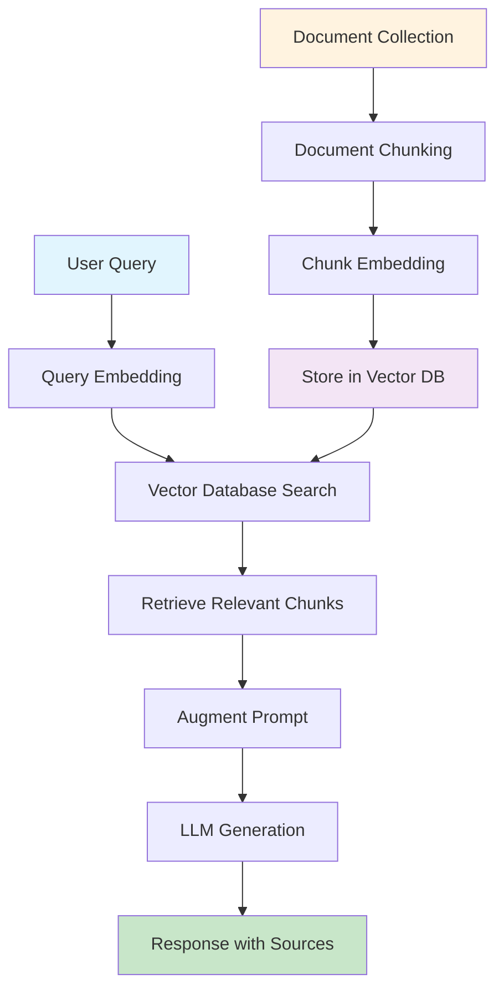

# RAG Knowledge Base

A comprehensive guide and resource repository for understanding and implementing Retrieval-Augmented Generation (RAG) systems.

## 📚 Overview

This repository contains detailed documentation, diagrams, and resources for learning about RAG (Retrieval-Augmented Generation) - a powerful technique that enhances Large Language Models by combining information retrieval with text generation.

## 🎯 What is RAG?

RAG is a technique that allows AI systems to access real-time, up-to-date information from external knowledge bases, making them more accurate and relevant for enterprise applications. Instead of relying solely on pre-training data, RAG-equipped systems can dynamically retrieve and incorporate fresh information.

## 📖 Documentation

### Main Guide
- **[RAG Explained: Comprehensive Guide](docs/RAG_Explained_Comprehensive_Guide.md)** - Complete guide covering concepts, implementation, and best practices

### Key Topics Covered

1. **Introduction to RAG** - Understanding the fundamentals
2. **The Problem RAG Solves** - Why traditional LLMs have limitations
3. **How RAG Works** - The three-step process (Retrieval, Augmentation, Generation)
4. **Key Components** - Vector databases, embedding models, chunking strategies
5. **Implementation Strategies** - Practical setup and configuration
6. **Best Practices** - Optimization techniques and considerations
7. **Challenges and Solutions** - Common issues and how to address them
8. **Future Trends** - Emerging developments in RAG technology

## 🏗️ RAG Architecture

## 🚀 Quick Start

### Prerequisites
- Python 3.8+
- Basic understanding of machine learning concepts
- Familiarity with vector databases and embeddings

### Key Technologies
- **Vector Databases**: ChromaDB, Pinecone, Weaviate
- **Embedding Models**: all-MiniLM-L6-v2, OpenAI embeddings
- **LLMs**: GPT-4, Claude, or open-source alternatives
- **Frameworks**: LangChain, LlamaIndex

## 📊 Use Cases

### Enterprise Applications
- **Knowledge Management**: Employee handbooks, product documentation
- **Customer Support**: FAQ automation, support ticket resolution
- **Legal & Compliance**: Contract analysis, regulatory research
- **Research & Development**: Technical documentation search

### Benefits
- ✅ Access to up-to-date information
- ✅ Reduced hallucination
- ✅ Source attribution
- ✅ No model retraining required
- ✅ Scalable to large document collections

## 🛠️ Implementation Considerations

### Chunking Strategies
- **Legal Documents**: Preserve paragraph structure, larger chunks (800-1200 tokens)
- **Conversational Data**: Sentence-level chunking with high overlap
- **Technical Docs**: Function or class-based chunking

### Embedding Models
- **all-MiniLM-L6-v2**: Compact and effective for most use cases
- **text-embedding-ada-002**: OpenAI's embedding model
- **Domain-specific models**: For specialized content

### Vector Databases
- **ChromaDB**: Lightweight, easy-to-use
- **Pinecone**: Managed service
- **Weaviate**: Open-source with advanced features

## 📈 Performance Optimization

### Best Practices
1. **Chunking Quality**: Experiment with different strategies
2. **Embedding Selection**: Test multiple models for your domain
3. **Similarity Thresholds**: Start conservative (0.7-0.8)
4. **Caching**: Implement for frequently accessed data
5. **Monitoring**: Track retrieval quality and response accuracy

### Common Challenges
- **Context Loss**: Use overlapping chunks
- **Retrieval Accuracy**: Implement re-ranking and filtering
- **Cost Management**: Optimize batch processing
- **Data Quality**: Implement validation and cleaning

## 🔮 Future Trends

- **Multimodal RAG**: Text, images, audio, video integration
- **Real-time RAG**: Streaming data and live updates
- **Federated RAG**: Distributed knowledge bases
- **Advanced Retrieval**: Graph-based and multi-hop reasoning

## 📚 Additional Resources

### Tools and Libraries
- [LangChain](https://python.langchain.com/) - Framework for building LLM applications
- [LlamaIndex](https://www.llamaindex.ai/) - Data framework for LLM applications
- [ChromaDB](https://www.trychroma.com/) - Vector database for embeddings
- [Sentence Transformers](https://www.sbert.net/) - Embedding models

## 🤝 Contributing

Contributions are welcome! Please feel free to submit a Pull Request. For major changes, please open an issue first to discuss what you would like to change.

### Areas for Contribution
- Additional use case examples
- Implementation tutorials
- Performance benchmarks
- Tool comparisons
- Best practice guides

## 📄 License

This project is licensed under the MIT License - see the [LICENSE](LICENSE) file for details.

---

**⭐ If you found this repository helpful, please give it a star!**

*Last updated: September 2025*