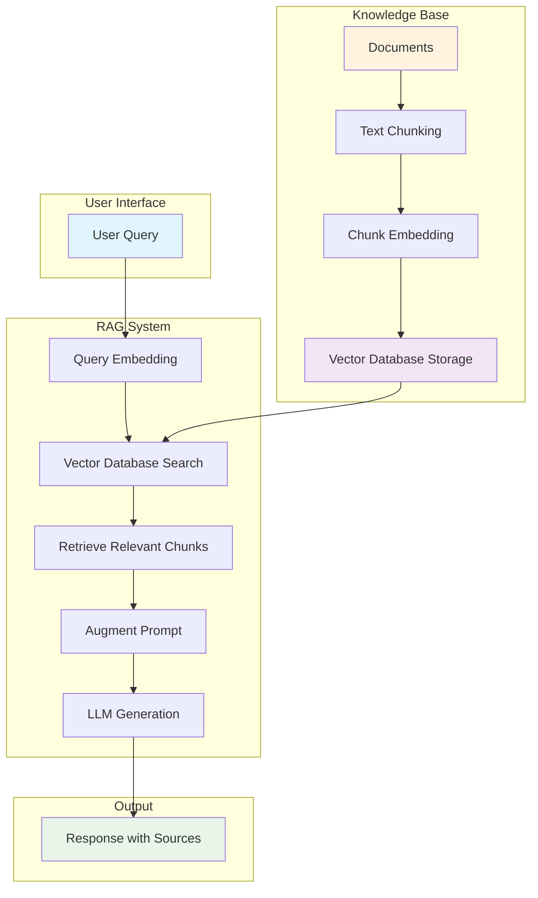
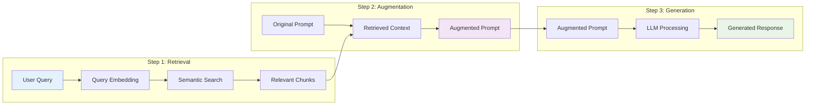
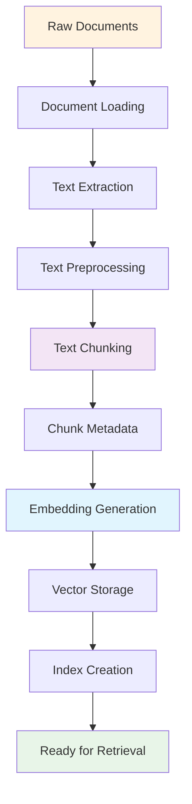
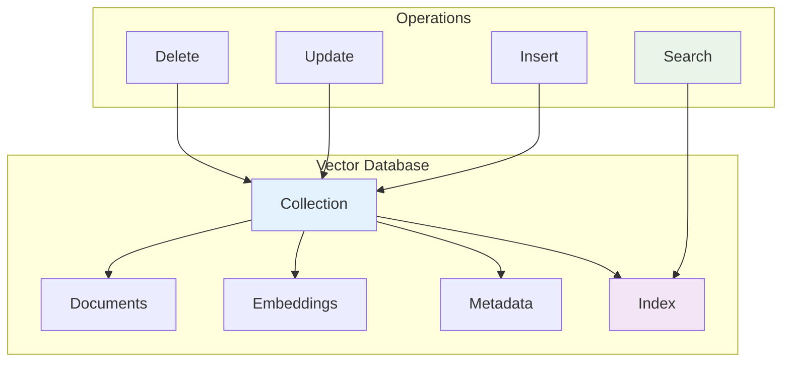
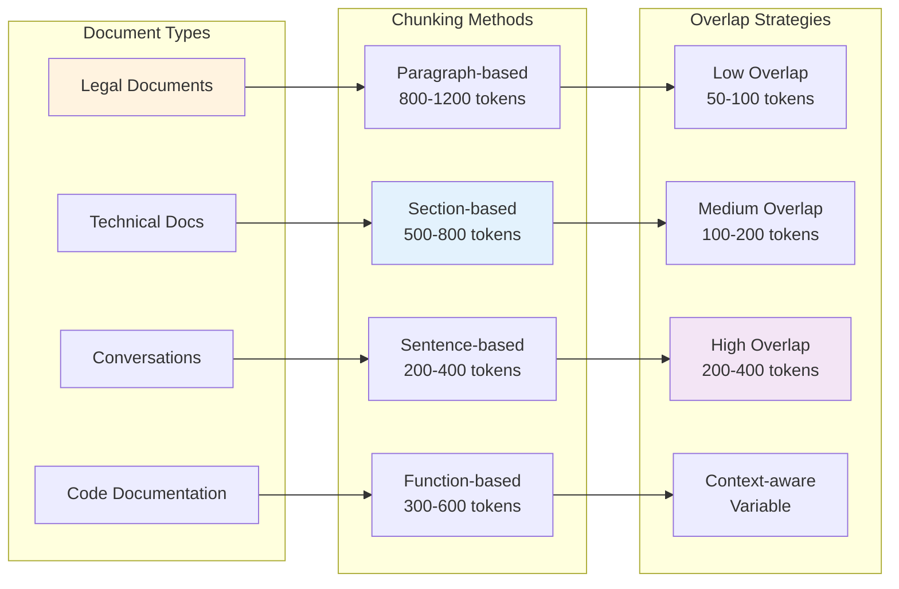
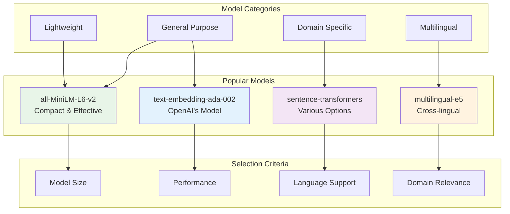
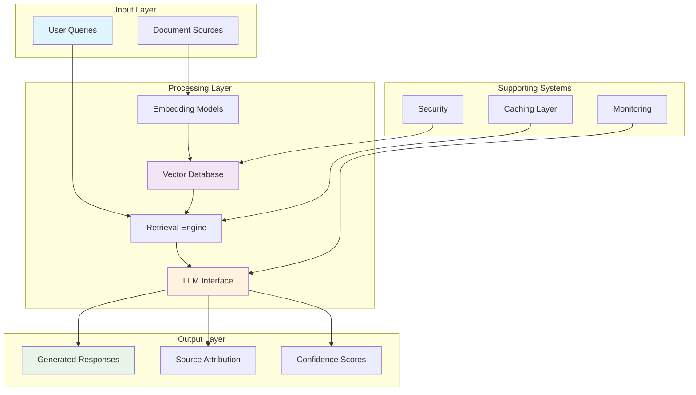
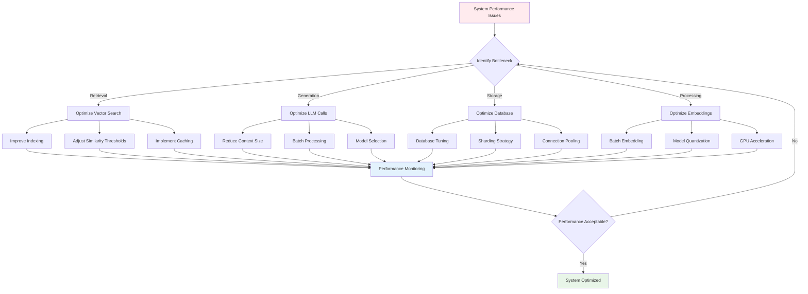
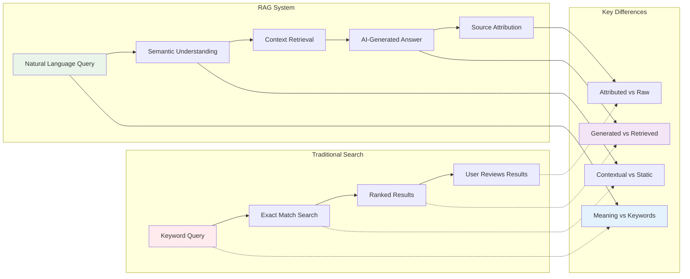
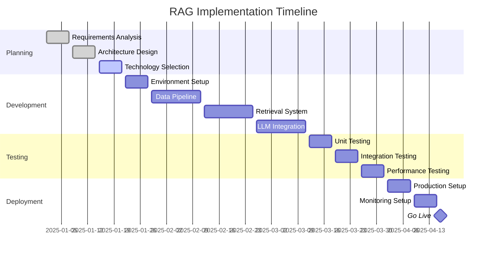

# RAG Architecture Diagrams

This document contains visual representations of RAG (Retrieval-Augmented Generation) concepts using Mermaid diagrams.

## 1. High-Level RAG Architecture

## 2. RAG Three-Step Process

## 3. Document Processing Pipeline

## 4. Vector Database Architecture

## 5. Chunking Strategies

## 6. Embedding Model Comparison

## 7. RAG System Components

## 8. Performance Optimization Flow

## 9. RAG vs Traditional Search

## 10. RAG Implementation Lifecycle

These diagrams provide visual representations of various RAG concepts, from high-level architecture to specific implementation details. They can be used in presentations, documentation, or as learning aids to better understand RAG systems.